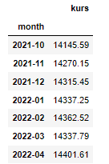
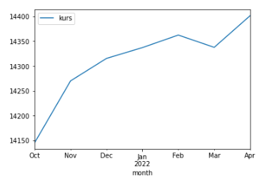

# Web-Scrapping using Beautifulsoup

Web scraping is an automatic method to obtain large amounts of data from websites. In this Capstone, I will do web scraping exchange rate Indonesian Rupiah to American USD from https://www.exchange-rates.org/history/IDR/USD/T

## Data 

## Plot

